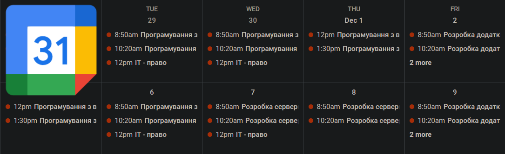

# Mystat Schedule To Google Calendar Sync



**Program for sync mystat schedule to google calendar**
 
## Installation

First you need to download the program to your computer:

```bash
$ git clone https://github.com/fan1ech00/mystat-google-calendar.git
```

To work with google calendar you need to create [a google cloud project](https://developers.google.com/workspace/guides/create-project).

Before using Google Calendar API, you need to enable its in a Google Cloud project. [Enable the API](https://console.cloud.google.com/flows/enableapi?apiid=calendar-json.googleapis.com).

To authenticate as an end user and access user data in your app, you need to create OAuth 2.0 Client ID. A client ID is used to identify a single app to Google's OAuth servers. 

1. In the Google Cloud console, go to **Menu > APIs & Services > Credentials**. [Go to Credentials](https://console.cloud.google.com/apis/credentials)
2. Click **Create Credentials > OAuth client ID**.
3. In the OAuth consent screen select **External User Type**
4. In the Test Users **Click Add user** and enter the email with which you will log in
5. Click **Application type > Desktop app**.
6. In the **Name** field, type a name for the credential. This name is only shown in the Google Cloud console.
7. Click **Create**. The OAuth client created screen appears, showing your new Client ID and Client secret.
8. Click **OK**. The newly created credential appears under OAuth 2.0 Client IDs.
9. Save the downloaded JSON file as `google-credentials.json`, and move the file to your working directory in the `config/` folder.

## Features

- Sync event name, time, audience number and teacher's fullname
- Specifying a date range for sync
- Choosing a name for the calendar
- Ability to choose a name prefix for events
- Fast sync a lot of events, thanks to the use of the Google Batch Requests

## Usage

```js
const mystatCredentials = {
  login: 'your_login',
  password: 'your_pass',
};

const syncOptions = {
  dateStart: DateTime.local(2023, 1, 1),
  dateEnd: DateTime.local(2023, 12, 31),
  calendarName: 'Mystat',
  eventPrefix: 'Prefix | '
};

try {
  const mystat = new Mystat();
  await mystat.authorize(mystatCredentials);

  const googleCalendar = new GoogleCalendar();
  await googleCalendar.authorize();

  await App.sync(mystat, googleCalendar, syncOptions);
} catch(err) {
  console.log(err);
}
```

